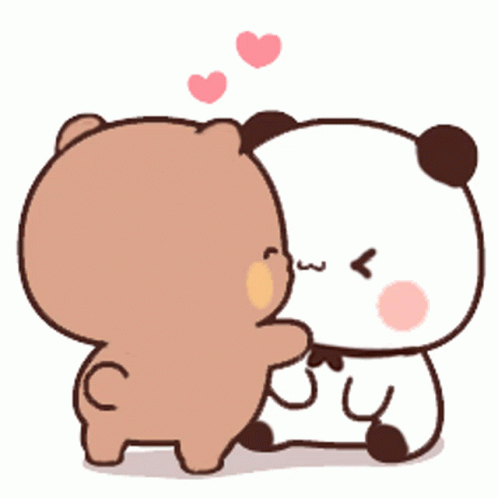

<!DOCTYPE html>
<html lang="en">
<head>
    <meta charset="UTF-8">
    <meta name="viewport" content="width=device-width, initial-scale=1.0">
    <title>Happy Birthday Manya!</title>
    <link rel="stylesheet" href="style.css">
</head>
<body>

    <section class="slide active" id="slide1">
        

            
            
For my sweetie pieeeeeeeeeee............... Happpy Birthday my baby girl, my cutie patootie, my sweetheart, my soulmate. Happy birthday cutiee

        

        

            <button class="btn" onclick="goToSlide(2)">Next ➡️</button>
        

    </section>

    <section class="slide" id="slide2">
        

            <h2>Our Journey till now....</h2>
            

                
May 2023 (9th Grade)
Our first meeting. We talked over a period of 6 months before finally starting to date each other.

                
April 25, 2024
Our first cheek kiss.

                
May 2024
The trip to Shimla.

                
10th Grade
We had the cultural which was really good.

                
January 2025
Our first kiss. And then we had a break which was terrible. Really terrible.

                
November 2025
We met a lot during this month.

                
December 2, 2025
We had our first intimate moment.

            

            <h3 class="journey-continues">And the Journey Continues...........</h3>
        

        

            <button class="btn" onclick="goToSlide(1)">⬅️ Previous</button>
            <button class="btn" onclick="goToSlide(3)">Next ➡️</button>
        

    </section>

    <section class="slide" id="slide3">
        

            <h3 class="small-heading">Now you must wonder sometimes, that why the heck does this guy love me ??? Well, I have the answer today.....</h3>
            
So yrr dekho, me loves you very much. Idk the reason, maybe tu sexy lgti hai, maybe you're kind hearted, maybe you're sweet, but na mujhe to tere baare mei sab kuchh achha lgta, especially your eyes 😍😍😍😍😍😍. Hayye yrr mai to pighal hi jaata unko dekh kr. Bss yrr, I love you bohot bohot bohot bohot bohot bohot bohot bohot bohot bohot bohot bohot bohot bohot saaraa😋😋😘😘😘😘😘😘😘😘😘😘. So never doubt my love for you. Mai bohot pyaar krta aapse 🥰🥰🥰🥰🥰.

        

        

            <button class="btn" onclick="goToSlide(2)">⬅️ Previous</button>
            <button class="btn" onclick="goToSlide(4)">Next ➡️</button>
        

    </section>

    <section class="slide" id="slide4">
        

            
            

                <h2>🔒 Secret Vault</h2>
                
You gotta type in a password to open it (It's your snap Eyes only password)

                <input type="password" id="password-input" placeholder="Enter Password">
                <button class="btn" onclick="checkPassword()">Unlock 🔓</button>
                
Wrong password cutie! Try again.

            

            

                
                
                
                
                
                
                
                
                
                
                
                
                
                

                    This is my sexy girlll🫣🤭🤭🤭🤭
                

            

        

        

            <button class="btn" onclick="goToSlide(3)">⬅️ Previous</button>
            <button class="btn" onclick="goToSlide(5)">Next ➡️</button>
        

    </section>

    <section class="slide" id="slide5">
        

            <h2>Our little things😚😚</h2>
            
Aapko shaayad na yaad ho, but I do. Soooo, Umm 1025😘😘😘😘😘😘. I remember everything uk, everything we used to do. I remember 304, 203 and all the letters and little things we used to do. I remember how we used to look at each other all the time during classes. Mujhe aaj vi yaad hai how we used to kiss each other when no one was looking, how we used to hold hands when we sat together. Mtlb yrr those were the good times. Bohot achha lgta tha. Mai to aapke thighs pr vi haath rkh leta tha kbhi kbhi 🤭. Yaad hai ek baar Science wali ne pakad vi liya tha, but we got saved. Bohot maza aaya tha. And uk I still remember hiw we used to write letters for each other. I still imagine sometimes you writing long letters just for me. Hum na yeh sab career bnakr try krenge. Sab krenge. Bohot maza aayega ik 😁😁.

        

        

            <button class="btn" onclick="goToSlide(4)">⬅️ Previous</button>
            <button class="btn" onclick="goToSlide(6)">Next ➡️</button>
        

    </section>

    <section class="slide" id="slide6">
        

            <h2>Now let's talk about you........</h2>
            
So, Miss Manya Anotra, Let's talk about you. So yrr, you're a very charming person. Bade mast ho aap. Mtlb na, whatever a man can desire, you have it all. You're cute, caring, lovable, understanding, have good intentions, are beautiful, loyal, listen to me, care about our future, understand things practically and help me in many ways. Mltb you have everything, so aap na jo question krte na ki mai kbhi jaunga, mai kbhi nhi jaunga. Ulta mujhe dar lgna chahiye ki kbhi aap mujhe chhod kr mat chle jao. Anyways, so let's see, mere cutu ka favourite color hai blue, she loves chocolates, khana khana vi bohot psnd hai, beauty products ke pichhe to pagal hi ho madamji, Mujhse bohot pyaar krte ho(I hope), Favourite Song is 'Sohnea'. So yeah I know a lot about you. So yrr, overall na, you're a wonderful person, to aap na chill kra kro, never doubt yourself. Okiee 🥰🥰🥰🥰

        

        

            <button class="btn" onclick="goToSlide(5)">⬅️ Previous</button>
            <button class="btn" onclick="goToSlide(7)">Next ➡️</button>
        

    </section>

    <section class="slide" id="slide7">
        

            <h2>A special message</h2>
            
I know bohot boring bnayi hai yeh website maine, me still learning how to do it, but one day I'll surely make a good one for you. but at last, mai just aapko kehna chahta ki you're gonna be the only one. Don't ever get demotivated by others. Logo ka kaam hai bkwas krna, just give them the idgaf attitude. Aapke paas vi nhi aayenge. So my sweetie pie, once again, HAPPY BIRTHDAY My love. Bohot achha lg rha aaj. My baby's finally 17 🥳🥳🥳🥳🥳🥳. Bss ek saal aur, then you're finally gonna go away from your toxic home. Maybe even mere saath reh skte. Achha so now I will tell you the most important thing. We're a team. We're a couple. So ab se, we are not gonna let anyone come between us. We'll always stay together okieee. You're my life dear and I don't want to lose you ever. You're the best thing that happened in my life and I will always nurture youuu. Once again, HAPPY BIRTHDAY CUTIEEE 🥳🥳🥳🥳🥳🥳🥳🥳🥳🥳🥳🥳. Biee bieee and thanks for watching this

        

        

            <button class="btn" onclick="goToSlide(6)">⬅️ Previous</button>
        

    </section>

    
</body>
</html>
